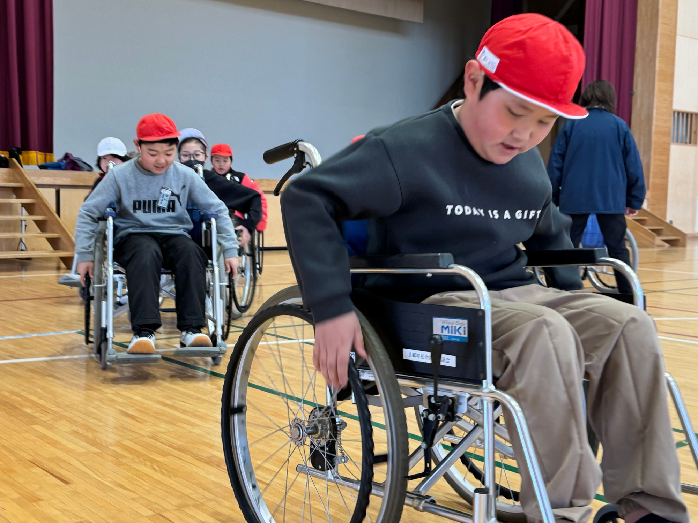

# 大郷町社会福祉協議会 福祉教育・防災教育プログラム案内

地域の方へ配布・説明するための案内資料です。

## ファイル

- `osato-fukushi-bosai-program.html` — 案内資料本体（1ファイルで完結。ブラウザで開けます）

## 収録している内容

- ふくし体験プログラム 5本（車いす体験／白杖体験／高齢者疑似体験／災害ボランティアセンター運営体験／認知症サポーター養成講座）
- 防災プログラム 5本（防災ビンゴゲーム／避難所体験／助けられ上手・助け上手になろう！／サバメシ作り／防災福祉マップづくり）
- 各プログラムの「どんな内容？」「ねらい」「対象・人数・所要時間・会場・用意するもの」
- 組み合わせ例 4パターン（学校／町内会／親子キャンプ／90分の入門編）
- 実施までの流れ（相談から、ふりかえりまでの6ステップ）
- よくあるご質問、お申し込み記入欄

## 写真の入れ方

各プログラムに写真スロット（点線の枠）があります。HTML内の

```html
<div class="photo">
  ...
</div>
```

をまるごと次のように置き換えてください。

```html

```

画像ファイルは、このHTMLと同じ場所に `photos` フォルダをつくって入れると管理しやすくなります。

## 印刷するとき

ブラウザの印刷機能（Ctrl+P / ⌘+P）でそのままA4印刷できます。背景を薄くした印刷用のレイアウトが入っています。

## 印刷前に記入が必要なところ

最後の「お申し込み・お問い合わせ」欄の住所・電話・FAX・メール・受付時間は空欄（＿＿）にしてあります。社協の正しい情報に置き換えてから配布してください。
所要時間・人数・貸出条件は目安として記載しているので、実際の運用に合わせて調整してください。
